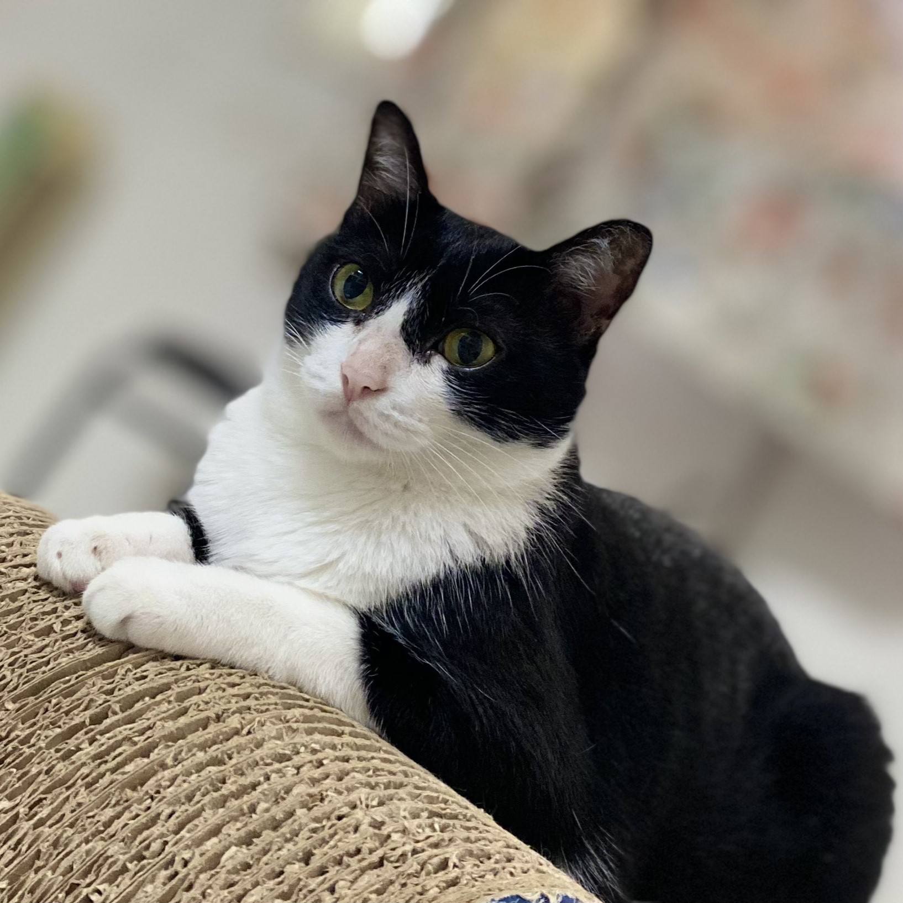

<head>
    <link rel="stylesheet" type="text/css" href="style.css">
</head>

## **Amazon NLP Analysis: Reviews Tells Secrets**
Discover what readers truly love based on Amazon reviews and rating.

    

Keywords: PowerBI, NLP, Sentimental Analaysis, Consensus score

## **AI agent: Claude MCP applications**
Build AI agent to demonstrate future of analysis and speed up workflow...

  

Keywords: GenAI 

📂 [Repository](https://github.com/OuOLeaf/claude-mcp-pipeline)

## **Stockaroo : Stock Backtesting Website** 
Backtesting on stock market for future investment...

  

Keywords: GCP, Google Analytics, Streamlit  
📂 [Repository](https://github.com/OuOLeaf/just_finance)

 

# **Experience**  

    <!-- Statistical Researcher -->
    

        
Statistical Researcher @ Rice University School of Engineering and Computing

        
(Nov 2024 – Present)

        <ul>
            <li>Enhanced battery energy storage efficiency using statistical approaches in MATLAB.</li>
            <li>Conducted sensitivity analysis to identify key patterns and optimize electrode design.</li>
        </ul>
    

    
    <!-- Data Scientist -->
    

        
Data Scientist @ Taiwan Academy of Banking and Finance

        
(Jan 2023 – Jun 2023)

        <ul>
            <li>Automated an ETL pipeline, reducing certification evaluation costs by 30%.</li>
            <li>Developed a statistical IRT model to determine passing criteria for financial certifications.</li>
            <li>Led IT system redesign for exam data storage, reducing data error rates by 12%.</li>
        </ul>
    

    
    <!-- Data Analyst -->
    

        
Data Analyst @ National Taipei University

        
(Jun 2022 – Dec 2022)

        <ul>
            <li>Increased subsidy funding by 10% by analyzing the impact of education programs on low-income students.</li>
            <li>Established an OLAP relational database (MSSQL) integrated with R for regression and classification analysis.</li>
            <li>Built interactive Power BI dashboards to monitor $200,000 in fund distribution and performance tracking.</li>
        </ul>
    

    
    <!-- Research Assistant -->
    

        
Research Assistant @ Research Center on Big Data and Smart City

        
(Jul 2021 – Dec 2022)

        
        
Machine Learning Research on Parkinson's Disease Detection:

        <ul>
            <li>Built ML models (Random Forest) on 5M time-series data, achieving 95% accuracy in symptom detection.</li>
            <li>Increased model performance by 5% using feature engineering (FFT and splines).</li>
        </ul>
        
        
Walking Motif Analysis on Telecommunication & Signal Data:

        <ul>
            <li>Developed an algorithm to track user trip generation, uncovering 92% of movement patterns and identifying 4+ high-traffic zones.</li>
            <li>Integrated 1.1B cellular data points across 3 telecom providers, improving data retention by 88% after noise reduction.</li>
        </ul>
    

## **Education**  
- M.S., Statistics	| Rice University (_December 2025_)	 			        		
- B.S., Statistics | National Taipei University  (_June 2023_)
  
## **Technical Skills:**  
**Programming Language**:Python, SQL, R, MATLAB, SAS, C++  
**Dashboards**: Power BI, Tableau, Google Analytics, Excel VBA, RShiny, Streamlit, PyQt5  
**Database**: MySQL, MSSQL, PostgreSQL, SQLite, Firebase  
**Tools**: AWS, Hadoop, Airflow, GCP, Git, Microsoft Office (Excel, Word, PowerPoint)

## **Beyond Me**
I'm also a 

<head>
    <meta charset="UTF-8">
    <meta name="viewport" content="width=device-width, initial-scale=1.0">
    <title>Three Column Cards</title>
    
</head>
<body>
    

        

            

                
            

            <h3 class="card-title">Badminton 🏸 Player</h3>
        

        

            

                
            

            <h3 class="card-title">Cat 🐱 Lover</h3>
        

        
        

            

                
            

            <h3 class="card-title">Ramen 🍜 Hunter</h3>
        

    

</body>

Reach out to me! My Email: yy152@rice.edu  
